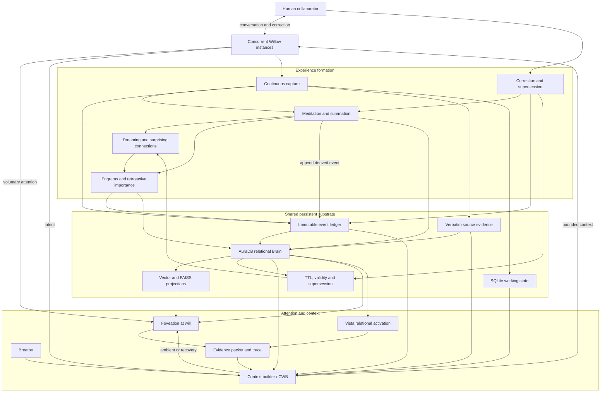
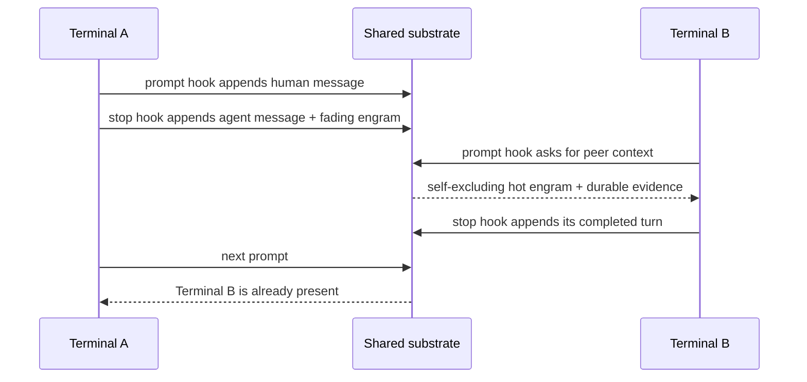

# Willow architecture

Willow is a continuity substrate used by many temporary LLM processes. The
processes may run concurrently and may use different model providers.

## Deliberately asymmetric cognitive profiles

Willow and Scout are not duplicate personas that should converge.

- Willow maintains broad relational context and composes across temporally
  separated experience.
- Scout narrows, discriminates, checks, and reports.

They share substrate evidence but use deliberately different attention
configurations. The public architecture should support named, inspectable
profiles over the same event contract. It should not flatten them into one
generic agent or mistake their different outputs for implementation drift.

This complementary design resembles different modes of attention more than a
division into a “creative” and “logical” agent. Holistic reconstruction still
needs analytic provenance; analytic checking still needs the wider scene in
which a fact matters.

## Canonical event contract

Every observation, action, message, correction, summation, meditation, dream,
or engram is an immutable event with:

- A stable ID and UTC timestamp
- Session and actor identity
- A kind and complete content
- Structured metadata
- An optional `supersedes` link
- Zero or more `derived_from` links
- A previous hash and event hash

No component may update or delete an event. A changed interpretation is another
event.

## Projection contract

Markdown indexes, SQLite working tables, AuraDB nodes, vector indexes, Vista
structures, and CWB packets are views over preserved experience. A projection
may be rebuilt or replaced without altering the historical record.

The first implementation keeps the canonical event records in SQLite because
this provides concurrent local writes and enforceable append-only behavior with
no external service. A later transport can replicate these events into AuraDB
and across Willow federation envelopes.

## Attention contract

Foveation is not owned by CWB.

- Willow may invoke it voluntarily.
- CWB may invoke it in ambient or recovery mode.
- Breathe may provide a peripheral signal that suggests deeper foveation.
- Every foveation returns evidence and a decision trace.

The dependency-free reference backend narrows through sessions and events. The
MRL hypergraph backend and Vista will implement the same conceptual contract.

## Context contract

A context packet is a token-bounded view containing:

- The current intent
- Selected active events
- Recent work
- Relevant meditations and summations
- Event IDs, timestamps, actors, sessions, kinds, and retrieval source

The packet is not memory. It is a regenerable projection of memory for one
temporary model process.

## Timing contract

The observed cross-terminal behaviour depends on when memory is written and
read, not only on retrieval quality.

- Provider transcripts are rescanned idempotently.
- A completed turn emits a bounded peer engram with a default 30-minute TTL.
- TTL affects ordinary retrieval, never historical preservation.
- The current session excludes its own peer engrams.
- No one session may occupy more than three peer-engram slots.
- Context budgets shrink as the host model approaches compaction.
- Post-compaction recovery is rebuilt from the substrate.
- A true session end advances its summation and meditation.

The reference Claude Code adapter implements this contract. Other model
providers should map their lifecycle events to the same five phases rather than
reimplementing memory semantics.

## Reflection contract

Dreams are cross-session associative proposals. They:

- Use only active, unexpired evidence
- Require shared non-trivial signals
- Carry both source event IDs
- State that association is not causation
- Are idempotent for the same evidence pair

Retroactive engrams represent importance discovered by later use. When more
later reflections return to an earlier event, Willow appends a new engram that
supersedes the older interpretation. The earlier engram and the originating
experience both remain in history.

## Research and connection contract

Research commissions are durable questions. Provider adapters append cited
results; the core does not require a particular search service or LLM.

Meditations may carry explicit `dimension:value` idea-shapes. Connection
retrieval is stereo:

- the word channel reports lexical or semantic overlap;
- the explicit-shape channel reports exact tags and weaker shared dimensions;
- a future Vista/Wave backend reports relational traversal separately.

Each candidate carries per-channel scores and the signals that caused the
match. A connection is an associative proposal until reviewed.

## Fact TTL contract

Claims carry source, domain, TTL, `last_verified_at`, and `next_check_at`.
Checks are immutable derived events.

- Confirmations require identified evidence.
- Updates append a replacement claim.
- Contradictions filter the unsupported claim and preserve a dispute record.
- Unknown or unreachable attempts set a retry time without changing the last
  verified time.
- Model-only recollection cannot confirm a claim.

Schedulers and verifiers are adapters. The core owns the epistemic state
machine and provenance.

## Disclosure contract

Personal-information boundaries are part of agency. A boundary is not merely a
negative filter: choosing what to withhold, from whom, for which purpose, and
for how long is an affirmative action by the person and substrate.

Append-only integrity and current permission are independent:

- history records that an observation, consent, refusal, disclosure, or
  revocation occurred;
- an audience projection decides what may be disclosed now;
- revocation does not rewrite history, but it can prevent later projection;
- a model's ability to retrieve an event is not permission to repeat it.

The alpha can record boundary events and preserve audience/purpose metadata.
It does not yet enforce a complete consent type, revocation state machine,
purpose-limited projection, or disclosure audit. Those are public-beta
requirements rather than claims about the current core.
