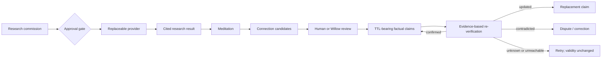

# Research, meditation, and connection

Willow's research loop is intentionally built around a naïve worker. The worker
does not need a persistent persona or a giant agent framework. It needs a
question, a provider, a durable result shape, and a way to return the evidence
to the shared substrate.



## What the deployed Doozer proved

The inspected Doozer implementation uses a small and effective pipeline:

1. append a research job to SQLite;
2. run either Tavily plus synthesis or Claude's web tools;
3. retain summary, write-up, and citations;
4. optionally speak the completion;
5. hand the full result to Willow, whose ordinary capture and reflection paths
   make it available to future sessions.

The value comes from the surrounding continuity substrate. The worker itself is
roughly a queue and two interchangeable functions.

The public core implements only the provider-neutral portions:

```bash
willow research queue \
  "What evidence has changed around recurrent connectome motifs?"

willow research list
```

An adapter completes the commission with a Markdown write-up and the sources it
actually used:

```bash
willow research complete evt-... result.md \
  --provider local-browser \
  --summary "A concise result" \
  --citation "Paper title|https://example.org/paper" \
  --shape "mechanism:recurrent-stabilisation"
```

Paid or externally mutating providers should remain safe-staged until the user
approves execution.

## Meditation is an integration step

A summation answers, "what happened?" A meditation asks:

- What changed?
- What connects?
- What matters now?
- What shape did the session or research result have?

The prose is preserved as reconstruction material. A meditation may also carry
explicit idea-shape dimensions:

```bash
willow meditate --session connectome \
  --text "Local recurrence and distributed continuity may share a mechanism." \
  --shape "mechanism:recurrent-stabilisation" \
  --shape "motion:distributed-to-local"
```

Shapes are not hidden model state. They are inspectable propositions supplied
by a person or a meditation adapter and retained with provenance.

## Stereo retrieval

Willow keeps connection channels distinct:

### Words

Lexical or semantic retrieval finds records that discuss similar things. A
future HippoRAG adapter may enrich this channel.

### Explicit idea-shape

Dimension/value tags can connect differently worded records. The reference
backend uses a transparent sparse comparison:

- exact shared tags are strong evidence;
- the same dimension with different values is a weaker structural rhyme;
- the trace reports which tags and dimensions caused the match.

```bash
willow connect --from-event evt-meditation...
willow connect --from-event evt-meditation... --with-vista
```

### Relational shape

Vista/Wave is a different geometry:

- memories cluster into Vistas with centre `mu`, spread `sigma`, and mass
  `alpha`;
- waypoints represent disproportionately connected memories and entities;
- degree-normalized spreading activation discovers multi-hop relational
  bridges;
- decayed citation mass is conductance;
- restart damping prevents a generic hub from consuming the field.

The dependency-free reference backend is available through `--with-vista` and
is used automatically as the contextual surround for `context`, `boot`, and
`foveate`. Vector similarity is not presented as though it were relational
Wave retrieval: candidates retain separate `vista_score`, `wave_score`, Vista
slugs, and carrying waypoints.

Connections returned by both word and structural channels are especially
useful anchors. Items unique to either channel are complementary lateral
surfaces, not automatic errors. See [VISTA.md](VISTA.md) for the equations,
attention cycle, and limits.

## Epistemic boundary

A research result, meditation, dream, and fact are different objects:

| Object | Meaning |
|---|---|
| Research result | What a provider returned, with its cited sources |
| Meditation | A derived interpretation of preserved experience |
| Connection | A reviewable association proposed by words or shape |
| Fact claim | A proposition with provenance and a freshness policy |
| Fact check | Evidence about whether a claim remains supported |

A model may propose connections and claims. It may not confirm a fact from its
own parametric recollection.
