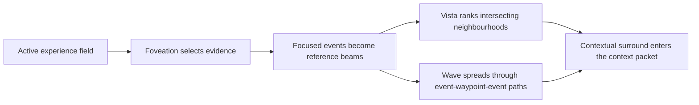

# Vista contextual-surround retrieval

Vista models recall from the position of an organism moving through projects,
places, relationships, questions, and changing concerns. It does not begin
with the database-shaped question, "which records have adjacent timestamps?"

> **Foveation selects what is in focus. Vista restores the contextual
> neighbourhood around it. Wave carries attention farther through that
> relational field.**

The reference implementation is in `willow_substrate.vista`. It is dependency-free,
local, and enabled by default in Willow context, boot, and deliberate
foveation.

## Founding principle

Human autobiographical recall is usually cue- and relation-led. A person may
remember a conversation through a place, a project, another person, an
emotional or conceptual shape, and only then reconstruct approximately when it
happened.

Vista therefore keeps timestamps as provenance and attention mass, but not as
coordinates for similarity, clustering, or traversal:

> **Time is preserved as evidence. Relationship is the principal coordinate
> of recall.**

This is not a claim that the implementation reproduces a brain. It is a design
choice to follow the shape of situated, reconstructive cognition instead of an
industrial record index.

## The attention cycle



This is structurally analogous to the movement from a contextual whole, to a
focused part, and back to an enriched whole. The analogy is about modes of
attention; Vista is not described as a literal cerebral hemisphere.

## Gaussian-splat lineage

An individual Vista is a soft Gaussian neighbourhood:

```text
Vista = (mu, sigma, alpha, members, waypoint signature, time span)
```

| Gaussian-splat idea | Vista equivalent |
|---|---|
| position `mu` | normalised centre in the event feature field |
| spread `sigma` | RMS cosine distance of members from the centre |
| opacity/mass `alpha` | recency-weighted log mass |
| camera pose | the current query and reference-beam set |
| rendered view | ranked Vistas and provenance-bearing event evidence |

For a query point `q`, the Gaussian component is:

```text
g(q, v) = exp(-(1 - dot(q, mu_v))^2 / (2 * sigma_v^2))
```

The reference backend combines that soft membership with proximity so a broad,
high-mass Vista cannot swallow every result. Singletons stay in the field with
a wider `sigma` floor; sparse experience is not discarded merely because it
does not yet belong to a cluster.

This is an adaptation of the representational shape of Gaussian splatting,
not a graphics renderer. There is no camera matrix, anisotropic covariance,
colour, spherical harmonics, rasterisation, or alpha compositing.

## Reference field

The clean-install backend builds an in-memory projection over active,
unexpired Willow events.

### Semantic geometry

The portable field combines:

- sparse TF-IDF word and local phrase features;
- explicit `dimension:value` idea-shapes;
- topics, projects, people, entities, places, and locations in metadata;
- `[[wikilink]]` references;
- recurring proper-noun phrases.

Connected components above a cosine threshold become Vistas. The event
timestamp is not part of the feature vector or clustering calculation.

This field is intentionally dependency-free and inspectable. It exercises the
Vista contract but is not represented as equivalent to the high-dimensional
embedding and HDBSCAN geometry in `agilemeshnet/vista`. That implementation is
a future richer adapter behind the same `RelationalBackend` protocol.

### Waypoint lattice

Waypoints are typed relational landmarks:

- `shape:` explicit idea-shapes;
- `topic:` and `project:` declared context;
- `person:`, `entity:`, and `place:` relational cues;
- `memory:` wikilinks and immutable `derived_from`/`supersedes` relations;
- low-prominence `actor:` cues.

Each event carries waypoint edges with prominence. Each waypoint has:

- degree: how many active events touch it;
- mass: recency-decayed edge prominence;
- conductance: the same mass used by Wave.

Generic high-degree landmarks are prevented from broadcasting at full strength
through degree normalisation. The same normalisation is applied when focused
events become reference beams, so a ubiquitous actor or project cannot
outweigh a specific idea-shape merely by appearing often.

### Reference-beam intersection

The top foveated event IDs become beam sources. Vista also resolves waypoints
named by the query. For a candidate Vista and beam `w`, relational overlap is:

```text
beam_weight(w) * members_touching(v, w) / members(v)
```

The total is normalised by query-beam mass. When semantic and waypoint evidence
are both present, the reference backend gives relational overlap a slight
majority:

```text
combined = 0.45 * semantic + 0.55 * waypoint_overlap
score = combined * (1 + 0.3 * alpha_v)
```

Every evidence item retains the source event, Vista slug, score, channels, and
waypoints that caused it to surface.

## Wave

Wave is multi-hop spreading activation over the bipartite
event-to-waypoint-to-event lattice.

At each hop:

1. event activation is divided across its waypoints in proportion to
   waypoint conductance times edge prominence;
2. waypoint activation is divided by waypoint degree before returning to
   events;
3. a restart/damping term pulls activation back towards the seed events.

The default is four hops with damping `0.5`. This allows a seed touching
waypoint A to reach an event touching A and B, then another event touching B,
without allowing a generic hub to seize the field.

Wave is returned as a separate channel. It is not relabelled as semantic
similarity.

## Commands

Normal context and boot use Vista automatically:

```bash
willow context "What matters around this research question?"
willow boot
willow foveate "trust and purpose-limited disclosure"
```

Inspect the field directly:

```bash
willow vista "trust and purpose-limited disclosure"
willow vista --seed-event evt-...
willow --json vista "collective pressure" --wave-hops 4
willow vista "collective pressure" --wave-damping 0.35 --max-events 5000
```

`--max-events` sets the dependency-free projection ceiling and
`--wave-damping` controls the fraction of activation restarted at the seeds on
each hop. The same values can be set when constructing `VistaBackend` for an
integrated CWB deployment.

Add Vista/Wave to connection finding:

```bash
willow connect --from-event evt-... --with-vista
```

Compare without the contextual surround:

```bash
willow context "query" --without-vista
willow boot --without-vista
willow foveate "query" --without-vista
```

## Safety and epistemic boundaries

- Only active, unexpired events enter the ordinary projection.
- A correction removes the superseded event from ordinary Vista and Wave
  retrieval without deleting its historical record.
- Vista is a rebuildable projection, never a second source of truth.
- A connection is an associative proposal, not proof of causation or truth.
- Retrieval is not permission to disclose. Audience, purpose, withholding,
  and consent policies remain separate from relevance.
- Reconstructed coherence may still be wrong. The returned event IDs and
  decision trace exist so a person or agent can inspect the evidence.

## Current limits

- The reference projection is rebuilt in memory for each short-lived CLI
  process and is capped at the most recent 2,000 active events by default.
  When that cap is reached, the decision trace says that older active events
  were not evaluated.
- Sparse lexical-semantic features are less capable than a strong embedding
  model at recognising paraphrases that lack explicit relational metadata.
- Connected-component clustering is a portable baseline, not HDBSCAN.
- Proper-noun extraction is deliberately simple and is not a complete entity
  recogniser.
- Timestamps influence fading mass but never geometry. This does not imply that
  arbitrary global chronology can be recovered from relations.
- External-user longitudinal evaluation remains necessary. Passing synthetic
  tests demonstrates mechanics, not general usefulness.

These limitations are why the backend is replaceable. The contract—not one
embedding model, graph database, or clustering library—is the stable part of
Willow.
